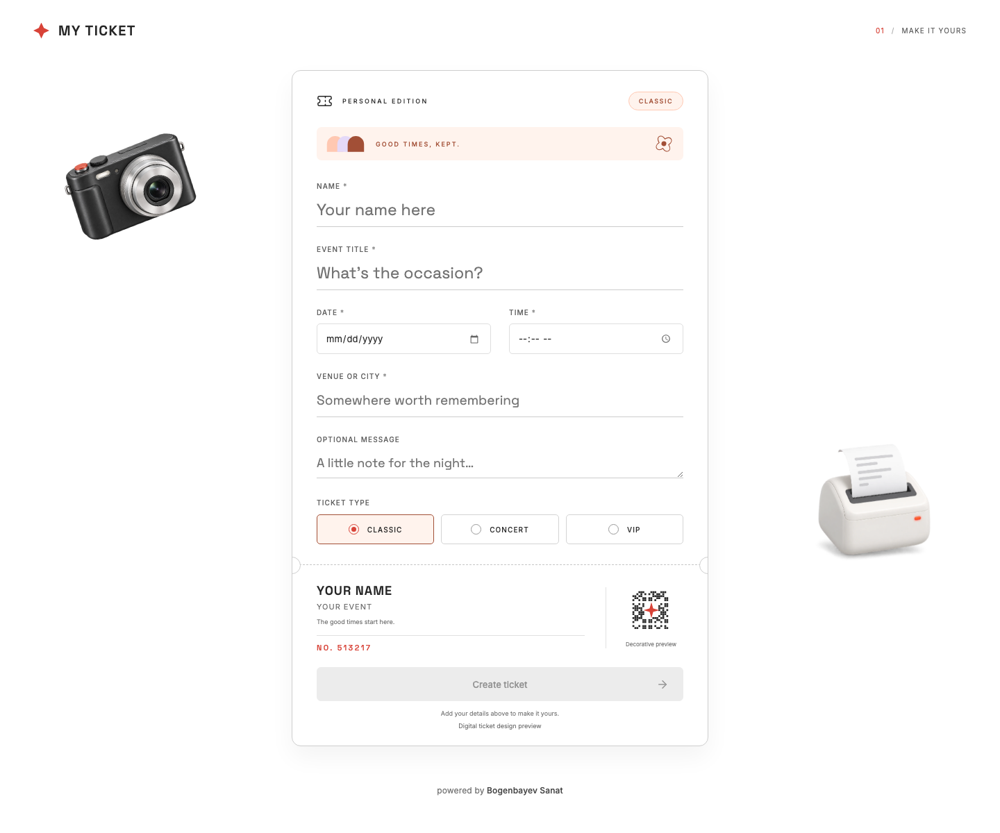
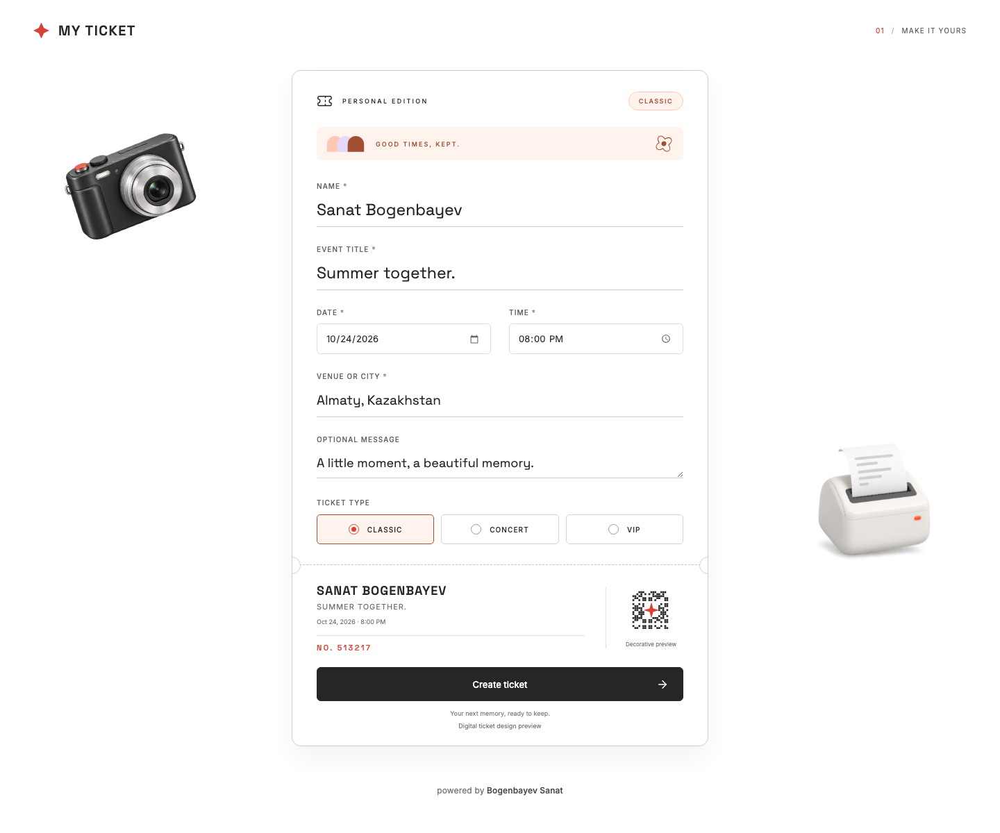
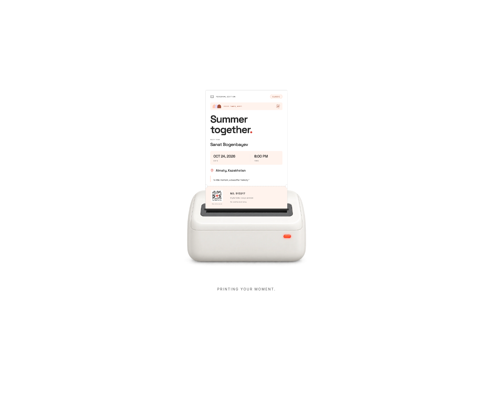
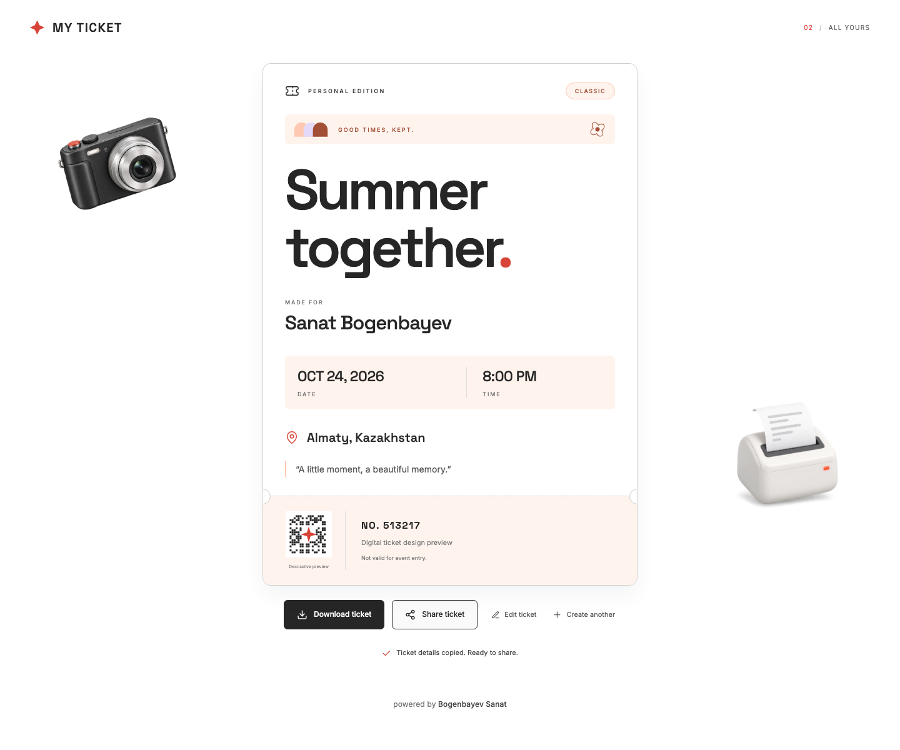

# MY TICKET

### Маленький билет. Большие воспоминания.

Создайте персональный цифровой билет прямо на листе: добавьте имя, событие и место, выберите оформление и нажмите **Create ticket**. Билет плавно выйдет из принтера — готовый результат можно сохранить как PNG или поделиться его деталями.

**React · TypeScript · Vite · Без регистрации · Всё в браузере**

---

## Как это работает

**Пустой билет → заполнение → печать → готовый билет → сохранение → поделиться**

Ниже — реальные скриншоты приложения. Во всех шагах используется один пример, чтобы было видно весь путь от пустого билета до результата.

### 01 · Начните с чистого билета

При открытии вы увидите белую страницу и один билет. Все поля находятся внутри него. Кнопка **Create ticket** пока неактивна: сначала нужно добавить обязательные данные.



### 02 · Сделайте его своим

Введите **Name**, **Event title**, **Date**, **Time** и **Venue or city**. В **Optional message** можно оставить короткое пожелание — это поле необязательное. Нижний отрывной корешок обновляется, пока вы печатаете.

Выберите настроение билета: **Classic** — нежный персиковый, **Concert** — светлый лавандовый, **VIP** — тёплый золотистый. Когда обязательные поля заполнены корректно, кнопка **Create ticket** станет доступна. Подсказки об ошибках появляются рядом с полями.



### 03 · Нажмите Create ticket

Страница ненадолго приглушается, появляется маленький принтер, и ваш билет плавно выходит из его щели. Анимация длится около **3,1 секунды**. На бумаге появляются именно те данные и оформление, которые вы выбрали.

Если в системе включено уменьшение движения, приложение использует короткое плавное появление вместо печати.



### 04 · Посмотрите готовый результат

Теперь перед вами законченный билет: название события, имя гостя, дата, время, место и ваше сообщение. Пастельные детали, маленький цветочный орнамент и отрывной корешок делают его похожим на памятный бумажный билет.

Внизу находятся декоративный номер и QR-подобный узор с подписью **Decorative preview**. Это дизайн-превью; узор не содержит данных для прохода на реальное мероприятие.


### 05 · Сохраните билет

Нажмите **Download ticket** — готовый дизайн сохранится как **PNG** с вашим номером в имени файла. Изображение можно оставить на телефоне или компьютере, отправить друзьям или распечатать. После скачивания появится подтверждение.

Если экспорт изображения недоступен в браузере, откроется диалог печати. В нём можно распечатать билет или сохранить его как PDF, если такая возможность доступна.


### 06 · Поделитесь воспоминанием

Нажмите **Share ticket**. В поддерживаемых браузерах откроется системное меню отправки **текстовых деталей билета**. Выберите доступное приложение или получателя.

Если системная отправка недоступна, приложение скопирует понятную сводку в буфер обмена: событие, имя, дату, время, место и другие детали. На скриншоте показано подтверждение копирования. Просто вставьте текст в сообщение. Для отправки самого изображения сначала скачайте PNG и прикрепите его к сообщению.

Если браузер запретил доступ к буферу обмена, появится текстовое поле и кнопка **Select text to copy** для ручного копирования.



### Хотите что-то изменить?

| Кнопка | Что произойдёт |
|---|---|
| **Edit ticket** | Вернёт редактируемый билет, сохранив все данные, оформление и номер. |
| **Create another** | Очистит поля, вернёт Classic и создаст новый декоративный номер. |

---

## Запуск проекта

Нужны Node.js **20.19+ или 22.12+** и npm.

```sh
npm install
npm run dev
```

Откройте адрес, который напечатает Vite, обычно **http://localhost:5173/**.

| Команда | Назначение |
|---|---|
| `npm run dev` | Локальная разработка с обновлением страницы при изменениях. |
| `npm run build` | Проверка TypeScript и production-сборка в `dist/`. |
| `npm run preview` | Локальный просмотр production-сборки. |
| `npm run format` | Форматирование исходников через Prettier. |

## Что внутри

- **React + TypeScript:** функциональные компоненты и hooks для формы, валидации, анимации и действий.
- **CSS:** адаптивная вёрстка, светлые темы, печать из принтера, стили для печати и reduced motion.
- **html-to-image:** загружается при скачивании и создаёт PNG в браузере.
- **Web Share API / Clipboard API:** отправка текстовых деталей или копирование с ручным запасным вариантом.
- **Локальные шрифты и изображения:** Inter, Space Grotesk, компактная камера и принтер без брендовых логотипов.
- **Доступность:** семантические подписи, видимый фокус, управление с клавиатуры и сообщения об ошибках рядом с полями.

```text
src/
├── App.tsx                 # Экран приложения и подпись автора
├── components/             # Форма, готовый билет, принтер, декор и кнопки
├── hooks/useTicketStudio.ts # Состояние, фокус, анимация, скачивание и отправка
├── lib/ticket.ts            # Проверка полей, форматирование и номер билета
└── styles.css              # Темы, адаптивность, анимации и печать
public/assets/              # Иллюстрации камеры и принтера
docs/screenshots/           # Реальные скриншоты каждого шага
```

## Данные и назначение

Регистрация, сервер и внешние API не нужны. Введённые данные остаются в памяти браузера; после обновления страницы форма очищается. Отправка или копирование запускаются только по нажатию **Share ticket**.

На каждом готовом билете есть отметка **Digital ticket design preview** и пояснение **Not valid for event entry**. Это персональный дизайн на память, а не система продажи или проверки входных билетов.

---

<p align="center">powered by <strong>Bogenbayev Sanat</strong></p>
